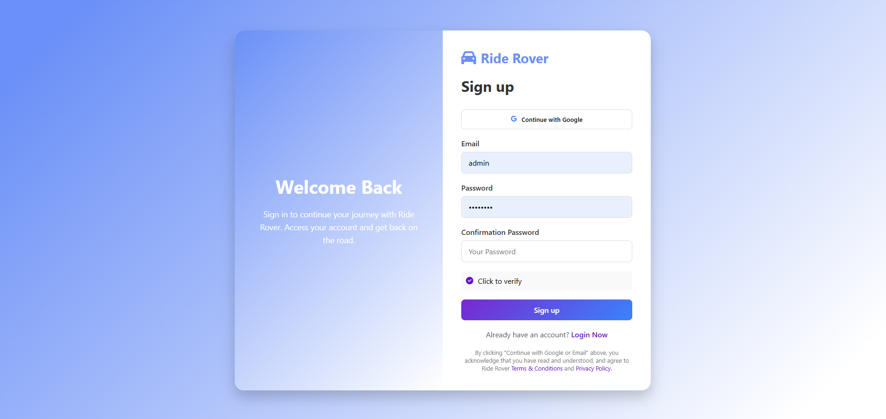
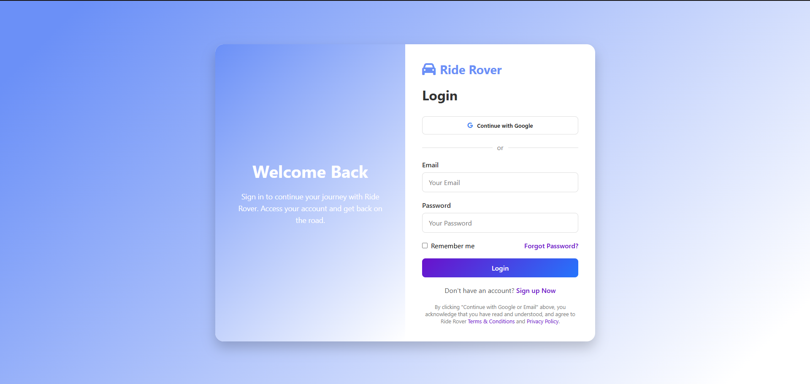

# Auth Page

This repository contains a small sign-in / sign-up static page demo.

Below are two placeholder screenshots (PNG). They are embedded as data URIs so they display in the README immediately. Replace them with real screenshots by adding PNG files to the `assets/` folder and updating the image paths.

## Screenshots

### Sign In


*Caption: Placeholder PNG for the Sign In screen.*

### Sign Up


*Caption: Placeholder PNG for the Sign Up screen.*

## How to replace the placeholders with real screenshots

1. Create or capture your screenshots and save them as PNG files.
2. Add the PNG files to the `assets/` folder, for example `assets/signin.png` and `assets/signup.png`.
3. Edit this `README.md` and replace the data-URI image links above with relative paths, for example:

```md


```

That's it — the README will show the real screenshots once the files are added.

## Notes

- These are tiny 1×1 placeholders to make the README render without requiring additional files. Replace them with full-size PNGs for real documentation.
- If you'd like, I can also add real PNG placeholder files into `assets/` for you to swap out.
